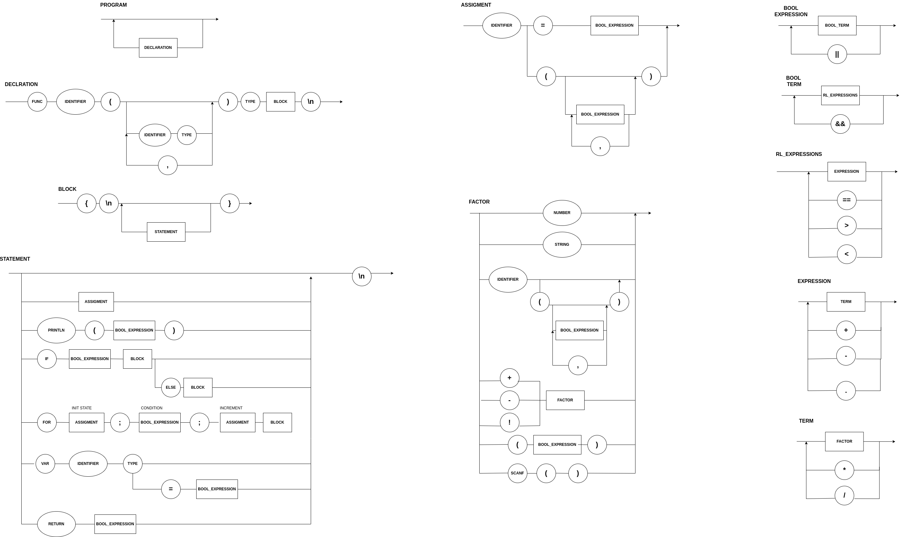

# Compiler
Compilador desenvolvido na disciplina de Lógica da Computação , 7° Semestre Engenharia da Computação , INSPER.

### Diagram ⚠️



### EBNF

```bash

EXPRESSION = TERM, { ("+" | "-"), TERM } ;
TERM = FACTOR, { ("*" | "/"), FACTOR } ;
FACTOR = ("+" | "-") FACTOR | "(" EXPRESSION ")" | number ; 

NUMBER = DIGIT , {DIGIT} ; 
DIGIT = 0 | 1 | ... | 9 ;

```
### Test Status 👩‍💻️

